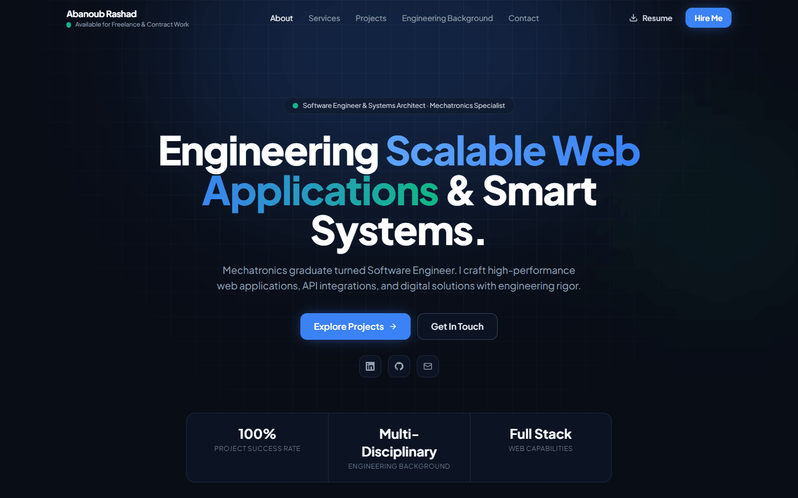
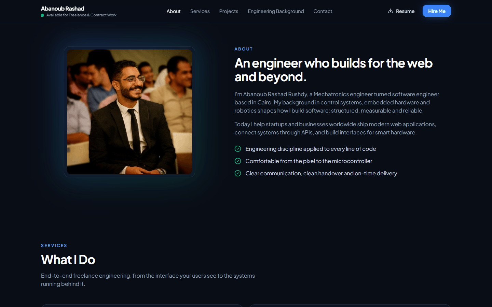
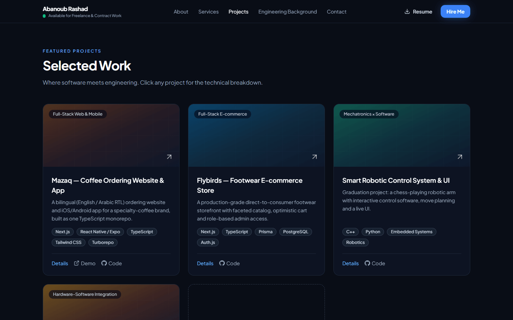
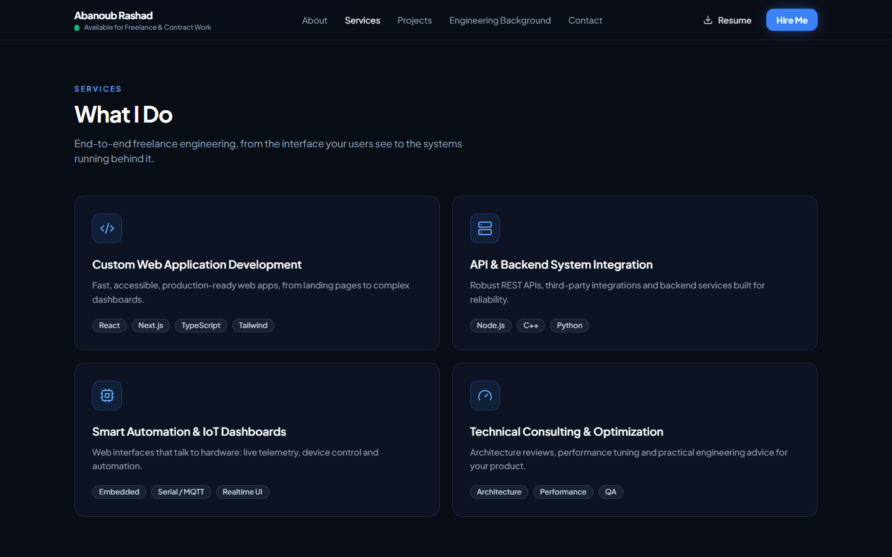
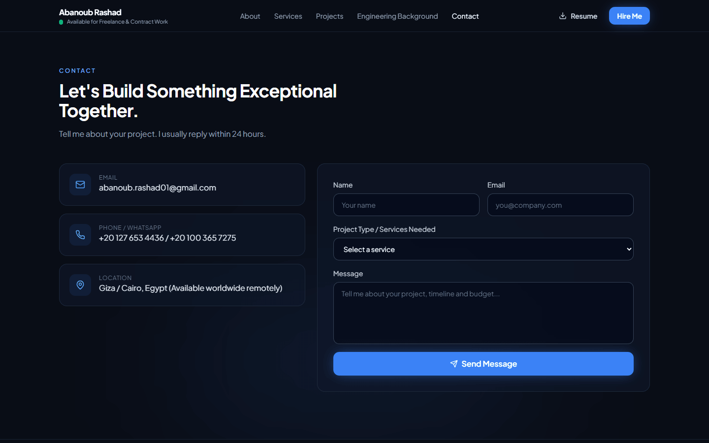
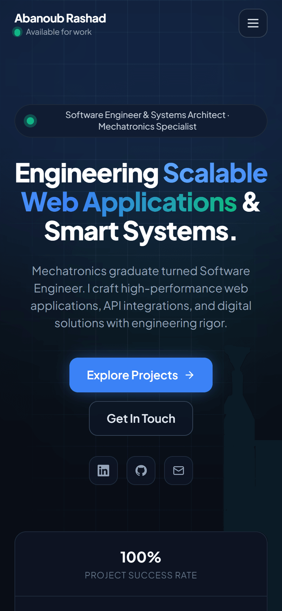

# Abanoub Rashad — Portfolio

Next.js 14 (static export) · TypeScript · Tailwind · Framer Motion · Firebase Hosting + Firestore CMS.

**Live site:** https://abanoub--rashad.web.app

## Screenshots

| Hero | About |
|---|---|
|  |  |
| **Projects** | **Services** |
|  |  |
| **Contact** | **Mobile** |
|  |  |

## Run locally
```
npm install
npm run dev        # http://localhost:3000  (CMS at /admin)
```

## CMS (add / edit / delete content)
Open **https://abanoub--rashad.web.app/admin**, sign in with Google (abanoub.rashad01@gmail.com),
edit Projects, Services, Skills, Stats or Profile, then click **Save changes**.
Changes are live immediately. No rebuild or redeploy needed.

Content is stored in Firestore at `portfolio/content`. If it's empty, the site shows the defaults in `lib/data.ts`.

## Deploy code changes
```
npm run build
firebase deploy
```
